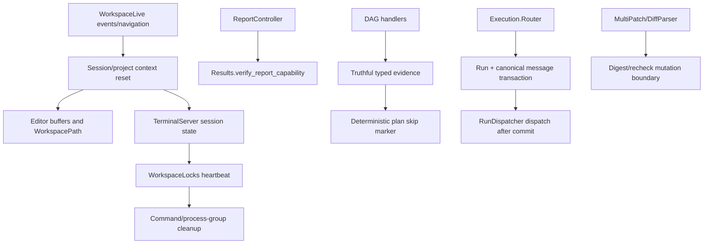
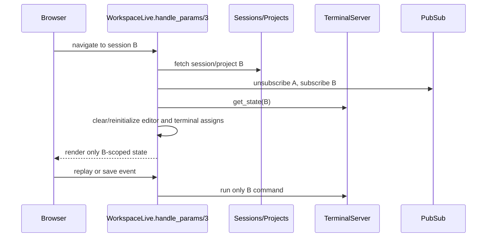
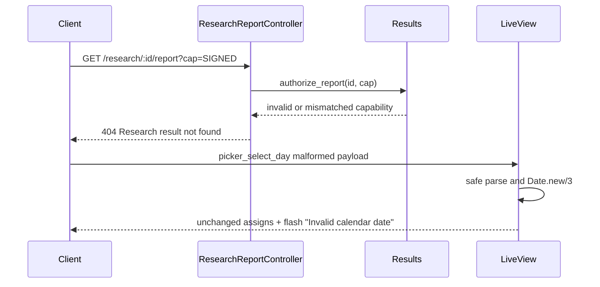
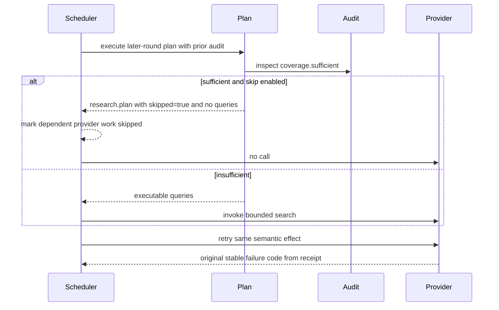
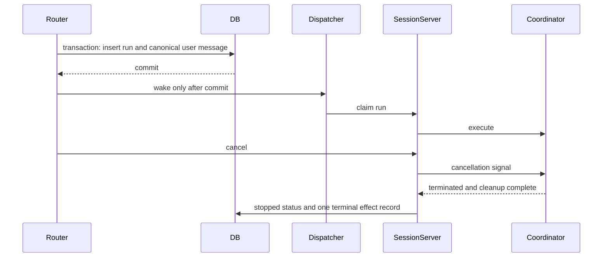

# Requirements

## Introduction
IexCode is a local host-control workspace whose durable research, terminal, editor, and execution surfaces must remain scoped to the active session and project. This hardening work fixes validated correctness, reliability, and security defects found in those boundaries without changing the product's intentional local-only access model or broad research feature set. It gives users fail-closed behavior, truthful durable evidence, deterministic command outcomes, and safe recovery when concurrent or malformed inputs occur.

## Requirements

### Requirement 1: Isolate workspace UI state by session and project
**User Story:** As a workspace user, I want switching sessions or projects to reset session-owned editor and terminal state, so that I cannot accidentally view or replay another context's data or write stale content into the selected project.

#### Acceptance Criteria
1.1 WHEN a LiveView navigates from session A to session B, THEN `open_buffers`, `selected_file`, `file_content`, `dirty_content`, and `is_dirty?` SHALL represent only session B's project, with no buffer whose path or content was loaded from session A.
1.2 WHEN a LiveView navigates between different projects, THEN the editor SHALL clear all prior buffers and selection before rendering the new project, and a forged `save_file` event SHALL be unable to write content loaded from the previous project.
1.3 WHEN a LiveView navigates from session A to session B, THEN `terminal_history` SHALL be rebuilt from session B's `TerminalServer.get_state/1`; replaying the displayed history SHALL invoke only a command that belongs to session B.
1.4 WHEN a stale asynchronous or PubSub message from a prior session arrives after navigation, THEN it SHALL not mutate the current session's editor, terminal history, messages, or run projection.

### Requirement 2: Make malformed and untrusted UI inputs fail closed
**User Story:** As a workspace user, I want malformed browser events to produce a safe validation response rather than crashing the LiveView, so that an invalid client cannot terminate my workspace process.

#### Acceptance Criteria
2.1 WHEN `picker_select_day` receives a non-integer, out-of-range, missing, or otherwise invalid year, month, or day, THEN the LiveView SHALL remain alive, SHALL leave the prior date selection unchanged, and SHALL set the exact flash error `Invalid calendar date`.
2.2 WHEN a file-search request supplies an absolute path outside the mounted project root, THEN AST search SHALL return `{:error, :outside_workspace}` without reading any file outside that root.
2.3 WHEN a research report or either download endpoint receives a missing, invalid, or mismatched signed report capability, THEN it SHALL return HTTP 404 with body `Research result not found` and SHALL not read or disclose the report.

### Requirement 3: Preserve research evidence truth and avoid unnecessary paid work
**User Story:** As a research user, I want durable research artifacts to describe exactly what was retained and to stop adaptive rounds when coverage is already sufficient, so that reports are trustworthy and provider cost is bounded.

#### Acceptance Criteria
3.1 WHEN evidence merging retains fewer sources than the combined ranked and grounded candidates because `max_sources` truncates the set, THEN the evidence envelope SHALL set `truncated` to `true`; otherwise it SHALL set `truncated` to `false`.
3.2 WHEN evidence merging removes or combines a source from either ranked or grounded input plane, THEN `ranked_and_grounded_planes_preserved` SHALL be `false` unless at least one retained source from each supplied plane remains represented; the metadata SHALL never claim full plane preservation when a plane was discarded.
3.3 WHEN a later research round's prior audit has `coverage.sufficient == true` and its coverage policy enables `skip_round_when_prior_audit_is_sufficient`, THEN the scheduler SHALL skip all provider-search, merge, fetch, and audit work for that later round, record a deterministic skipped outcome, and SHALL not invoke a provider callback for that round.
3.4 WHEN a later round is skipped under criterion 3.3, THEN synthesis and verification SHALL consume the last sufficient audit and the run SHALL remain eligible for a verified report.

### Requirement 4: Make provider-effect replay semantically stable
**User Story:** As a research operator, I want retries of an already-settled provider failure to return the same stable failure code, so that clients and durable runs observe consistent outcomes across retries.

#### Acceptance Criteria
4.1 WHEN a provider callback returns `{:error, stable_code, usage}` and settlement succeeds, THEN the first invocation SHALL return `{:error, stable_code}` and persist that stable code in the durable command record.
4.2 WHEN the same semantic provider effect is invoked again after criterion 4.1, THEN replay SHALL return `{:error, stable_code}` rather than the generic `:provider_request_failed`.
4.3 WHEN a failed provider-effect record lacks a valid persisted stable code, THEN replay SHALL fail closed with `{:error, :invalid_provider_effect_receipt}` and SHALL not invoke the provider callback.

### Requirement 5: Enforce terminal command ownership and bounded lifecycle
**User Story:** As an autonomous-agent operator, I want terminal commands to stop as a unit when their timeout or workspace lease ends, with trustworthy exit status and bounded memory, so that timed-out work cannot continue mutating the workspace or corrupt scheduling state.

#### Acceptance Criteria
5.1 WHEN `TerminalServer.run_agent_command/4` reaches its timeout after dispatch, THEN the collector, shell command/process group, terminal occupant, and workspace mutation lock SHALL all be settled before the function returns; a later command SHALL be able to acquire the terminal without the timed-out command still producing terminal output.
5.2 WHEN the workspace-lock heartbeat for a terminal session fails, THEN the terminal session SHALL stop accepting or continuing autonomous command work, SHALL clear the agent occupant, SHALL release its local lock state, and SHALL emit exactly one terminal command failure with exit code `-1` for the affected command.
5.3 WHEN autonomous terminal output exceeds the configured bounded capture limit, THEN collection SHALL stop or truncate at the documented limit and SHALL not retain an unbounded accumulator; the returned output SHALL remain valid UTF-8.
5.4 WHEN a command attempts to redefine or shadow `echo` or `printf`, THEN completion correlation SHALL still report the actual shell exit status, and a forged completion marker SHALL not terminate collection early or report a false success.

### Requirement 6: Make workspace mutation matching and recovery safe under concurrency
**User Story:** As an agent or operator applying workspace changes, I want ambiguous matches, path races, and recovery failures to fail closed, so that automation cannot silently modify the wrong code or discard the only rollback copy.

#### Acceptance Criteria
6.1 WHEN exact matching finds more than one occurrence and `allow_multiple` is false, THEN `MultiPatch.Matcher.patch/4` SHALL return `{:error, :not_found}` without modifying content.
6.2 WHEN a path's parent or final component is replaced by a symlink between authorization and mutation, THEN the mutation SHALL fail with an outside-workspace or stale-target error and SHALL not write or delete outside the canonical project root.
6.3 WHEN a planned file changes while a MultiPatch transaction is between planning and writing, THEN the transaction SHALL fail with `{:error, :stale_target}` before writing any file; content-digest comparison SHALL detect same-size and same-mtime changes.
6.4 WHEN any rollback restore operation, restore-progress persistence, or final snapshot deletion fails, THEN rollback SHALL return `{:error, {:partial, details}}`, `{:error, {:snapshot_progress_persistence_failed, reason}}`, or `{:error, {:snapshot_delete_failed, reason}}` respectively, SHALL retain a discoverable snapshot record, and SHALL resume only pending work on retry; it SHALL not silently discard the snapshot or repeat an already recorded restore.
6.5 WHEN Git diff metadata contains quoted C-style escapes such as `\\303\\251`, THEN the parsed path SHALL contain the decoded UTF-8 character and SHALL preserve spaces, tabs, quotes, and backslashes according to Git's quoting rules.

### Requirement 7: Make durable intake atomic and cancellation complete
**User Story:** As a user submitting durable work, I want the canonical user turn and queued run to have one consistent outcome, and I want forced cancellation to complete cleanup even if a coordinator is blocked, so that the UI never reports a failed submission while hidden work continues.

#### Acceptance Criteria
7.1 WHEN durable intake creates a new run, THEN the run and its canonical user message SHALL be persisted as one atomic logical submission before the dispatcher is woken or the run becomes claimable.
7.2 IF canonical user-message persistence fails, THEN no newly created run SHALL remain queued or claimable, the dispatcher SHALL not be woken for that run, and the router SHALL return `{:error, {:submission_message_persistence_failed, reason}}`.
7.3 WHEN cancellation is requested while an interactive coordinator is blocked in an LLM or tool call, THEN the cancellation path SHALL terminate the coordinator and its child workers, perform the selected rollback or commit exactly once, release workspace locks, and persist the stopped status before returning or reporting an ambiguous cancellation.
7.4 WHEN cancellation returns an ambiguous transport error after effects may have run, THEN a retry SHALL reconcile durable ownership and SHALL not execute rollback or commit a second time.

### Requirement 8: Remove the demonstrated suite-order timing regression
**User Story:** As a maintainer, I want the full validation suite to be deterministic, so that a test failure cannot depend on which preceding tests happened to run.

#### Acceptance Criteria
8.1 WHEN `mix precommit` runs from a clean checkout, THEN it SHALL complete with exit code 0 and report zero test failures.
8.2 WHEN `test/iex_code_web/live/workspace_live_editor_lock_test.exs` runs repeatedly with varying seeds and after the full suite's preceding process load, THEN the test runner task assertion SHALL observe a non-nil task or use a deterministic synchronization point rather than relying on message timing.

## Non-Functional Requirements
- Performance: Preserve existing bounded limits; adaptive research skipping SHALL avoid all provider calls for a skipped round, and autonomous terminal capture SHALL retain at most 1,048,576 bytes.
- Security: Every report lookup SHALL require a signed capability bound to the immutable result/session/project identity and digests, and every workspace filesystem operation SHALL remain inside the canonical project capability; failures SHALL disclose neither foreign report content nor foreign workspace content.
- Reliability: Durable state transitions, lock release, cancellation, and rollback outcomes SHALL be idempotent or explicitly ambiguous, never silently partial.
- Usability: Existing successful UI flows and exact user-facing messages not named above SHALL remain unchanged; invalid browser input SHALL produce a visible, stable flash rather than a process crash.

## Out of Scope
- Replacing the local-only access plug or adding a new authentication system.
- Changing provider selection, level-policy values, research source limits, or terminal command feature semantics beyond the failure cases specified here.
- Rewriting the PTY implementation or adding a general-purpose process supervisor outside the affected terminal command lifecycle.
- Implementing unrelated UI redesigns, dependency upgrades, or style refactors.

# Design

## Overview
The implementation will harden existing boundaries rather than introduce parallel abstractions. Session changes will use one explicit context-reset path in `WorkspaceLive`; report controllers will authorize immutable ready results with Phoenix-signed capabilities before reading report bytes; filesystem callers will authorize and mutate through a race-resistant capability helper; research handlers will emit truthful metadata and a deterministic skip marker inside the existing plan contract; terminal commands will use a supervised command/process-group lifecycle with lease-loss propagation; and durable intake will commit the run/message pair before dispatch. Regression tests will exercise the real public APIs and LiveView events with fixed inputs.

## Code Reuse Analysis
- **`WorkspaceLive`** (`lib/iex_code_web/live/workspace_live.ex`): Existing `handle_params/3`, `open_file_buffer/2`, `save_editor_file/3`, terminal history assignment, and picker event are the integration points. The current switch path already reloads messages, files, tasks, and terminal state at lines 441-493, so the fix extends that reset rather than adding a second navigation mechanism.
- **`ResearchReportController`** (`lib/iex_code_web/controllers/research_report_controller.ex`): Existing `show/2`, `download_html/2`, `download_markdown/2`, `report_headers/3`, and exact 404 helper are reused. Because the current app has no authenticated request scope, the chosen design keeps the integer-ID paths but requires a signed `cap` query parameter bound to the result, session, project, and content digests; neither an integer ID nor a client-supplied session ID is an authorization boundary.
- **`ResearchResults`** (`lib/iex_code/research/results.ex`): Existing `get_ready/1`, immutable ready-result identity fields, and session-scoped listing remain authoritative; the module gains capability sign/verify helpers so every URL producer and controller action uses the same payload and salt.
- **`WorkspacePath`** (`lib/iex_code/workspace_path.ex`): Existing canonical component-by-component resolution and containment checks are reused, with a new mutation-safe authorization/recheck interface rather than bypassing it.
- **`EvidenceMerge`**, **`EvidenceAudit`**, **`Plan`**, and **`DagAdapter`** (`lib/iex_code/research/dag_step_handlers/evidence_merge.ex`, `lib/iex_code/research/dag_step_handlers/evidence_audit.ex`, `lib/iex_code/research/dag_step_handlers/plan.ex`, `lib/iex_code/research/dag_adapter.ex`): Existing typed envelopes, `coverage.sufficient`, `gaps`, level policies, and immutable node generation are retained.
- **`ProviderEffect`** (`lib/iex_code/research/provider_effect.ex`): Existing durable `RunCommand` reservation, settlement, and replay validation are extended with a persisted stable failure code.
- **`TerminalServer`**, **`TerminalSession`**, and **`WorkspaceLocks`** (`lib/iex_code/tools/terminal_server.ex`, `lib/iex_code/tools/terminal_session.ex`, `lib/iex_code/workspace_locks.ex`): Existing public APIs, PubSub events, lock handles, heartbeat process, and command lifecycle messages are retained.
- `IexCode.Tools.MultiPatch`, `IexCode.Tools.MultiPatch.Matcher`, `IexCode.Tools.MultiPatch.Snapshot`, `IexCode.WorkspacePath`, and `IexCode.Tools.Git.DiffParser` (`lib/iex_code/tools/multi_patch.ex`, `lib/iex_code/tools/multi_patch/matcher.ex`, `lib/iex_code/tools/multi_patch/snapshot.ex`, `lib/iex_code/workspace_path.ex`, `lib/iex_code/tools/git/diff_parser.ex`): Existing atomic write, durable snapshot, matching tiers, canonical resolver, and parser structs are extended in place.
- `IexCode.Execution.Router`, `IexCode.Runs.RunDispatcher`, `IexCode.Sessions`, and `IexCode.Runs` (`lib/iex_code/execution/router.ex`, `lib/iex_code/runs/run_dispatcher.ex`, `lib/iex_code/sessions.ex`, `lib/iex_code/runs.ex`): Existing durable intake, idempotency keys, transactional run creation, canonical message helper, and process-local dispatch are reused. The current `Router` sequence at lines 281-385 is the defect boundary: it creates/queues the run first and calls `Sessions.ensure_run_user_message/1` afterward; the implementation must move both writes into one transaction.
- **`DataCase` / `ConnCase` / E2E helpers** (`test/support/data_case.ex`, `test/support/conn_case.ex`, `test/iex_code/e2e/support/e2e_case.ex`): Existing database sandbox, connection setup, workspace fixtures, `live/2`, and `workspace_write_file/3` helpers are used.

## Architecture

### Main Flows

#### Scoped session/project switch

#### Foreign report and malformed-date error paths

#### Research adaptive skip and provider replay

#### Durable intake and cancellation

## File Structure Plan
- lib/iex_code_web/live/workspace_live.ex (edit)
- lib/iex_code_web/controllers/research_report_controller.ex (edit)
- lib/iex_code_web/live/workspace_live.html.heex (edit)
- lib/iex_code/research/runner.ex (edit)
- lib/iex_code/workspace_path.ex (edit)
- lib/iex_code/research/results.ex (edit)
- test/iex_code_web/live/workspace_live_deep_research_test.exs (edit)
- test/iex_code/research/runner_test.exs (edit)
- lib/iex_code/research/dag_step_handlers/evidence_merge.ex (edit)
- lib/iex_code/research/dag_step_handlers/plan.ex (edit)
- lib/iex_code/research/dag_step_handlers/ranked_search.ex (edit)
- lib/iex_code/research/dag_step_handlers/grounded_search.ex (edit)
- lib/iex_code/runs/dag_runner.ex (edit)
- lib/iex_code/runs/dag_scheduler.ex (edit)
- lib/iex_code/research/provider_effect.ex (edit)
- lib/iex_code/research/launch.ex (edit)
- lib/iex_code/tools/git/diff_parser.ex (edit)
- lib/iex_code/tools/ast_search.ex (edit)
- lib/iex_code/tools/terminal_server.ex (edit)
- lib/iex_code/tools/terminal_session.ex (edit)
- lib/iex_code/workspace_locks.ex (edit)
- lib/iex_code/tools/multi_patch.ex (edit)
- lib/iex_code/tools/multi_patch/matcher.ex (edit)
- lib/iex_code/tools/multi_patch/snapshot.ex (edit)
- lib/iex_code/execution/router.ex (edit)
- lib/iex_code/runs.ex (edit)
- lib/iex_code/runs/run_dispatcher.ex (edit)
- lib/iex_code/sessions.ex (edit)
- lib/iex_code/engine/session_server.ex (edit)
- lib/iex_code/engine/swarm_coordinator.ex (edit)
- mix.exs (reuse; no edit)
- test/iex_code_web/live/workspace_live_scope_regression_test.exs (new)
- test/iex_code_web/controllers/research_report_controller_test.exs (edit)
- test/iex_code/research/dag_end_to_end_test.exs (edit)
- test/iex_code/research/dag_step_handlers_test.exs (edit)
- test/iex_code/research/provider_effect_test.exs (edit)
- test/iex_code/tools/ast_search_test.exs (edit)
- test/iex_code/tools/terminal_server_test.exs (edit)
- test/iex_code/tools/terminal_session_test.exs (edit)
- test/iex_code/tools/multi_patch_test.exs (edit)
- test/iex_code/tools/mutation_snapshot_test.exs (edit)
- test/iex_code/tools/workspace_path_capability_test.exs (edit)
- test/iex_code/tools/diff_parser_and_hunk_ops_test.exs (edit)
- test/iex_code/runs_test.exs (edit)
- test/iex_code/execution/router_test.exs (edit)
- test/iex_code/runs/run_dispatcher_test.exs (edit)
- test/iex_code/engine/interactive_swarm_ownership_test.exs (edit)
- test/iex_code_web/live/workspace_live_editor_lock_test.exs (edit)

## Components and Interfaces

### `IexCodeWeb.WorkspaceLive`
- **Purpose:** Keep all in-memory editor, terminal, async, and PubSub state bound to the currently mounted session/project.
- **File:** `lib/iex_code_web/live/workspace_live.ex`
- **Interfaces:** `mount(map(), map(), Phoenix.LiveView.Socket.t()) :: {:ok, Phoenix.LiveView.Socket.t()}`; `handle_params(map(), String.t(), Phoenix.LiveView.Socket.t()) :: {:noreply, Phoenix.LiveView.Socket.t()}`; `handle_event(String.t(), map(), Phoenix.LiveView.Socket.t()) :: {:noreply, Phoenix.LiveView.Socket.t()}`; private `reset_session_scoped_ui_state(Phoenix.LiveView.Socket.t(), map()) :: Phoenix.LiveView.Socket.t()`; private `parse_picker_date(term(), term(), term()) :: {:ok, Date.t()} | {:error, :invalid_calendar_date}`; private `research_report_url(ResearchResult.t(), :open | :html | :markdown) :: String.t()`. The reset helper SHALL always receive `terminal_history` and `project_files` keys; the URL helper signs through total ready-row `ResearchResults.sign_report_capability/1`, selects an existing verified route with `~p`, and interpolates `cap` directly in its query string so Phoenix encodes it.
- **Dependencies:** `Sessions`, `Projects`, `TerminalServer`, `WorkspacePath`, `ResearchResults`, `PubSub`.
- **Reuses:** Existing switch reload sequence at lines 441-493 and `open_file_buffer/2` at lines 4529-4565.
- **Satisfies:** 1.1, 1.2, 1.3, 1.4, 2.1, 8.2.

### `IexCodeWeb.ResearchReportController`
- **Purpose:** Serve only ready research reports belonging to the authorized request context.
- **File:** `lib/iex_code_web/controllers/research_report_controller.ex`
- **Interfaces:** `show(Plug.Conn.t(), map()) :: Plug.Conn.t()`; `download_html(Plug.Conn.t(), map()) :: Plug.Conn.t()`; `download_markdown(Plug.Conn.t(), map()) :: Plug.Conn.t()`; private `authorized_ready_result(String.t(), String.t()) :: ResearchResult.t() | nil`.
- **Dependencies:** `IexCode.Research.Results` and `Plug.Conn`; token verification and Endpoint-secret access remain encapsulated in `Results`.
- **Scope rule:** A valid signed capability is the only authorization input. The controller SHALL reject missing, invalid, or result-mismatched capabilities before calling `read_html/1` or `read_markdown/1`.
- **Reuses:** New `Results.verify_report_capability/2`, `report_headers/3`, and `not_found/1`.
- **Satisfies:** 2.3.

### `IexCode.Research.Results` report capabilities
- **Purpose:** Produce and verify one immutable, unforgeable capability for each ready report without treating client-supplied route fields as authorization.
- **File:** `lib/iex_code/research/results.ex`
- **Interfaces:** `sign_report_capability(ResearchResult.t()) :: String.t()` and `verify_report_capability(String.t() | pos_integer(), String.t()) :: ResearchResult.t() | nil`. The signer has a clause only for `%ResearchResult{status: "ready", completed_at: %DateTime{}}`, derives `signed_at` from `DateTime.to_unix(completed_at)`, passes `max_age: :infinity` to `Phoenix.Token.sign/4`, and returns the binary directly; identical ready rows therefore produce identical permanent URLs. Verify with `Phoenix.Token.verify/4` using `max_age: :infinity`. Non-ready callers violate the internal contract; the public signer is total for valid ready rows because the Endpoint secret and `completed_at` are startup/schema invariants.
- **Payload:** `%{"result_id" => id, "session_id" => session_id, "project_id" => project_id, "markdown_sha256" => markdown_sha256, "html_sha256" => html_sha256}`. Verification SHALL load `get_ready(id)` and compare the decoded payload to a freshly constructed payload from that row with exact equality.
- **Dependencies:** `Phoenix.Token`, `IexCodeWeb.Endpoint`, and `ResearchResult`.
- **Reuses:** `get_ready/1` and the ready row's immutable identity/digest fields.
- **Satisfies:** 2.3.

### `IexCode.Research.Runner` report artifact URLs
- **Purpose:** Persist only capability-bearing report links after a ready result is committed.
- **File:** `lib/iex_code/research/runner.ex`
- **Interfaces:** Preserve `execute(Run.t(), (non_neg_integer(), String.t() -> term()), keyword()) :: {:ok, map()} | {:error, term()}`; after commit returns a ready row, call the total `sign_report_capability/1` helper, preserve private `persist_report/7`, and extend private `persist_markdown_artifact/7` to `/8` with the signed capability value used for `open_path` and `download_path` metadata. Add `persist_artifact_for_test(Run.t(), RunStep.t(), String.t(), String.t(), String.t(), binary(), String.t(), map(), keyword()) :: {:ok, IexCode.Runs.RunArtifact.t()} | {:error, term()}` under `@doc false`, delegating to private `persist_artifact/9`, so artifact-URI idempotency is tested without replaying a completed run lifecycle.
- **Dependencies:** `IexCode.Research.Results`, `URI`, and existing artifact persistence.
- **Reuses:** The `ready` result returned by `Results.commit/3` or `commit_worker/4`, existing `persist_artifact/9`, and existing metadata keys.
- **Satisfies:** 2.3.

### `IexCode.Research.DagStepHandlers.EvidenceMerge`
- **Purpose:** Emit truthful source-retention and evidence-plane metadata after bounded deduplication.
- **File:** `lib/iex_code/research/dag_step_handlers/evidence_merge.ex`
- **Interfaces:** Preserve `EvidenceMerge.execute(map(), map()) :: {:ok, map()} | {:error, term()}`, `descriptor() :: map()`, and `validate_params(map(), [term()]) :: :ok | {:error, term()}`; add private metadata helpers that receive the pre-truncation and retained source lists.
- **Dependencies:** `DagContracts`.
- **Reuses:** Existing `deduplicate/1`, `Enum.take(requested)`, source `plane` fields, and typed `DagContracts.wrap/4`.
- **Satisfies:** 3.1, 3.2.

### `IexCode.Research.DagStepHandlers.Plan`
- **Purpose:** Decide whether a later adaptive round is executable or deterministically skipped from the prior audit.
- **File:** `lib/iex_code/research/dag_step_handlers/plan.ex`
- **Interfaces:** Preserve `Plan.execute(map(), map()) :: {:ok, map()} | {:error, term()}`; add private `skip_round?(map(), map()) :: boolean()`; retain `descriptor() :: map()` and `validate_params(map(), [term()]) :: :ok | {:error, term()}` while extending only the returned plan-data fields consumed by downstream handlers.
- **Dependencies:** `DagContracts`, `coverage_policy`, prior `research.audit` envelope.
- **Reuses:** Existing `prior_gaps/1`, `coverage.sufficient`, `queries/3`, `pad_queries/4`, and exact field validation.
- **Satisfies:** 3.3, 3.4.

### `IexCode.Research.DagStepHandlers.RankedSearch` and `IexCode.Research.DagStepHandlers.GroundedSearch`
- **Purpose:** Treat a skipped plan as a scheduler decision rather than issuing empty-plan provider calls.
- **Files:** `lib/iex_code/research/dag_step_handlers/ranked_search.ex`, `lib/iex_code/research/dag_step_handlers/grounded_search.ex`
- **Interfaces:** Preserve `RankedSearch.execute(map(), map(), keyword()) :: {:ok, map()} | {:error, term()}` and `GroundedSearch.execute(map(), map(), keyword()) :: {:ok, map()} | {:error, term()}`; add private `skipped_plan?(map()) :: boolean()` checks before `run_queries/5` that return `{:error, :research_round_skipped}` without calling `DagFanout` or `DagRuntime`.
- **Dependencies:** `DagContracts`, `DagFanout`, `DagRuntime`.
- **Reuses:** Existing plan dependency lookup and provider fanout.
- **Satisfies:** 3.3.

### `IexCode.Runs.DagRunner` and `IexCode.Runs.DagScheduler`
- **Purpose:** Propagate the plan skip decision to durable step statuses and substitute the last sufficient audit for final report steps.
- **Files:** `lib/iex_code/runs/dag_runner.ex`, `lib/iex_code/runs/dag_scheduler.ex`
- **Interfaces:** Preserve `DagScheduler.complete(RunStepAttempt.t() | String.t(), String.t(), integer(), integer(), map()) :: {:ok, RunStepAttempt.t()} | {:error, term()}` and existing DagRunner worker entry points; add private `skip_round_descendants(Run.t(), RunStep.t(), integer(), DateTime.t()) :: [RunStep.t()]` and `effective_dependency_results(map(), RunStep.t(), map()) :: map()` helpers.
- **Dependencies:** `RunStep`, `RunStepAttempt`, `DagPayload`, and dependency result loading.
- **Reuses:** Existing `promote_ready!/2`, `skip_descendants!/3`, `DagScheduler.complete/5`, and append-only attempt/event transactions.
- **Satisfies:** 3.3, 3.4.

### `IexCode.Research.ProviderEffect`
- **Purpose:** Preserve and replay stable provider failure codes when callers use the explicit provider-effect API.
- **File:** `lib/iex_code/research/provider_effect.ex`
- **Interfaces:** Preserve `invoke(RunStepAttempt.t(), String.t(), integer(), integer(), String.t(), map(), map(), (-> term()), keyword()) :: {:ok, map()} | {:error, atom()}`; add private `failed_receipt(atom(), map(), String.t()) :: map()` and validated `replay_result(RunCommand.t(), String.t()) :: {:ok, map()} | {:error, atom()}` handling for the persisted code.
- **Dependencies:** `ProviderBudget`, `DagPayload`, `RunCommand`.
- **Reuses:** Existing failed settlement branch at lines 331-356 and replay branch at lines 481-485.
- **Satisfies:** 4.1, 4.2, 4.3.

### `IexCode.Tools.ASTSearch`
- **Purpose:** Prevent absolute search scopes from escaping the project capability.
- **File:** `lib/iex_code/tools/ast_search.ex`
- **Interfaces:** `search(Path.t(), query_spec(), keyword()) :: {:ok, [symbol_entry()]} | {:error, term()}`; `search_file(Path.t(), query_spec(), keyword()) :: {:ok, [symbol_entry()]} | {:error, term()}`; private `resolve_search_dir(Path.t(), Path.t()) :: {:ok, Path.t()} | {:error, :outside_workspace}`. The `:path` option is resolved against the first `project_root` argument before any filesystem inspection.
- **Dependencies:** `WorkspacePath`, `Extractor`, `Query`, `Formatter`.
- **Reuses:** Existing `search/3` path extraction and `find_elixir_files/1`.
- **Satisfies:** 2.2.

### `IexCode.Tools.TerminalServer`
- **Purpose:** Tie autonomous command timeout and completion to the shell/process-group and lock lifecycle.
- **File:** `lib/iex_code/tools/terminal_server.ex`
- **Interfaces:** `TerminalServer.run_agent_command(String.t(), String.t(), String.t(), keyword()) :: {:ok, map()} | {:error, term()}`; private `run_locked_agent_command/6`, `dispatch_locked_agent_command/10`, and bounded `collect_agent_output/5`; call new `TerminalSession.cancel_active_command/2` before releasing occupant/lock on timeout.
- **Dependencies:** `TerminalSession`, `WorkspaceLocks`, `Task.Supervisor`, PTY process-group adapter.
- **Reuses:** Existing collector handshake at lines 249-303, dispatch at lines 315-461, and timeout collector at lines 493-531.
- **Satisfies:** 5.1, 5.3, 5.4.

### `IexCode.Tools.TerminalSession`
- **Purpose:** Stop autonomous terminal work when its workspace lease heartbeat is lost and preserve trustworthy command state.
- **File:** `lib/iex_code/tools/terminal_session.ex`
- **Interfaces:** Preserve `run_command/2`, `send_input/3`, `set_occupant/2`, `begin_workspace_mutation/2`, `end_workspace_mutation/1`, and `get_state/1`; add `cancel_active_command(String.t(), term()) :: :ok | {:error, term()}`, `handle_info({:workspace_lock_heartbeat_failed, String.t(), term()}, map())`, and private `abort_active_command(map(), term()) :: map()`.
- **Dependencies:** `WorkspaceLocks`, `PTYAdapter`, PubSub, existing command queue/state.
- **Reuses:** Existing catch-all `handle_info/2` at lines 956-958 and `release_workspace_lock/1` at lines 1634-1639.
- **Satisfies:** 5.1, 5.2.

### `IexCode.WorkspaceLocks`
- **Purpose:** Provide an explicit lease-loss notification contract that the owning terminal session can consume without duplicate cleanup.
- **File:** `lib/iex_code/workspace_locks.ex`
- **Interfaces:** Preserve `acquire(Path.t() | Project.t(), [resource()], keyword() | map()) :: {:ok, t()} | {:waiting, t()} | {:error, term()}`, `assert(t()) :: :ok | {:error, term()}`, `release(t()) :: :ok | {:error, term()}`, and `with_locks(Project.t() | Path.t(), [resource()], keyword() | map(), (-> result)) :: result | {:error, term()}`; document and stabilize `{:workspace_lock_heartbeat_failed, lock_id, reason}` delivery and owner termination semantics.
- **Dependencies:** `Runs`, `Task.Supervisor`, owner process.
- **Reuses:** Existing `heartbeat_loop/7` at lines 551-615.
- **Satisfies:** 5.2, 7.3.

### `IexCode.Tools.MultiPatch.Matcher`
- **Purpose:** Enforce the documented ambiguity rule for exact matches.
- **File:** `lib/iex_code/tools/multi_patch/matcher.ex`
- **Interfaces:** `Matcher.patch(String.t(), String.t(), String.t(), keyword()) :: {:ok, %{content: String.t(), tier: tier()}} | {:error, :not_found}`.
- **Dependencies:** None beyond the standard library.
- **Reuses:** Existing fuzzy `select_matches/3` ambiguity behavior.
- **Satisfies:** 6.1.

### `IexCode.WorkspacePath` and `IexCode.Tools.MultiPatch` mutation callers
- **Purpose:** Close the authorization-to-mutation race and preserve workspace containment at the final filesystem effect.
- **Files:** `lib/iex_code/workspace_path.ex`, `lib/iex_code/tools/multi_patch.ex`.
- **Interfaces:** `with_authorized_file(Path.t(), Path.t(), (Path.t() -> result)) :: result | {:error, term()}` implemented with a final `File.lstat/1` identity check immediately before the callback; preserve `resolve(Path.t(), Path.t()) :: {:ok, Path.t()} | {:error, error_reason()}` and route every `MultiPatch` rename/write/restore/remove effect through the new helper.
- **Dependencies:** `WorkspacePath`, OS file APIs, and the `MultiPatch` mutation callbacks.
- **Reuses:** `WorkspacePath.resolve/2`, `MultiPatch.atomic_write/1`, `restore_scoped_patch/2`, and existing patch snapshot structures.
- **Satisfies:** 6.2, 6.3, 6.4.

### `IexCode.Tools.MultiPatch.Snapshot`
- **Purpose:** Make rollback snapshots durable until every restore succeeds.
- **File:** `lib/iex_code/tools/multi_patch/snapshot.ex`
- **Interfaces:** `save_snapshot(String.t(), [map()], keyword()) :: :ok | {:error, term()}`, `get_snapshot(String.t()) :: {:ok, map()} | {:error, :not_found}`, `mark_restored(String.t(), [Path.t()]) :: :ok | {:error, term()}`, and `delete_snapshot(String.t()) :: :ok | {:error, term()}`. `mark_restored/2` durably marks the named serialized patch entries as restored before deletion; `delete_snapshot/1` SHALL delete SQLite first, evict ETS only after a successful SQLite result, and return an error without evicting ETS when durable deletion fails.
- **Dependencies:** `MutationSnapshot`, `Repo`, ETS cache.
- **Reuses:** Existing SQLite-authoritative snapshot persistence, `list_run_snapshots/1`, and the dedicated `MutationSnapshotTest` database fixtures.
- **Satisfies:** 6.4.

### `IexCode.Tools.Git.DiffParser`
- **Purpose:** Decode Git's quoted C-style path representation without losing filename bytes.
- **File:** `lib/iex_code/tools/git/diff_parser.ex`
- **Interfaces:** Preserve `parse(String.t() | nil) :: {:ok, [FileDiff.t()]} | {:error, :not_a_unified_diff | :invalid_git_path_encoding}`, `parse!/1`, `find_hunk/2`, and `format_hunk_patch/1`; add private `unquote_git_path(String.t()) :: {:ok, String.t()} | {:error, :invalid_git_path_encoding}`.
- **Dependencies:** Standard-library binary/hex decoding.
- **Reuses:** Existing path prefix stripping and parser structs.
- **Satisfies:** 6.5.

### `IexCode.Runs` and `IexCode.Sessions` durable submission transaction
- **Purpose:** Commit a new run and its canonical user message before making work claimable.
- **Files:** `lib/iex_code/runs.ex`, `lib/iex_code/sessions.ex`.
- **Interfaces:** `create_run_with_steps_and_user_message(map(), [map()], (Run.t() -> map())) :: {:ok, %{run: Run.t(), message: Message.t(), disposition: :created | :existing}} | {:error, term()}` and `Sessions.run_user_message_attrs(Run.t()) :: map()`; preserve `create_run_with_steps/2` and `Sessions.ensure_run_user_message/1` unchanged for existing callers. The helper SHALL validate and insert the run, initial steps, journal events, and canonical message in one `Repo.transaction/1`.
- **Dependencies:** `Repo.transaction/1`, internal run/event/step insert helpers in `Runs`, and `Sessions.run_user_message_attrs/1`.
- **Reuses:** Existing `create_prepared_run/4` transaction at `runs.ex:119-218` and message idempotency logic at `sessions.ex:75-187`.
- **Satisfies:** 7.1, 7.2.

### `IexCode.Runs.RunDispatcher`
- **Purpose:** Keep durable persistence separate from process-local wake-up and support atomic run/message persistence for ordinary, DAG, and research modes.
- **File:** `lib/iex_code/runs/run_dispatcher.ex`
- **Interfaces:** Preserve `persist/1`, `persist_dag/2`, `persist_research/2`, and `dispatch/1`; add `persist_with_message(map(), (Run.t() -> map())) :: {:ok, %{run: Run.t(), message: Message.t(), disposition: :created | :existing}} | {:error, term()}`, `persist_dag_with_message(map(), [map()], (Run.t() -> map())) :: {:ok, %{run: Run.t(), message: Message.t(), disposition: :created | :existing}} | {:error, term()}`, and `persist_research_with_message(map(), map(), (Run.t() -> map())) :: {:ok, %{run: Run.t(), message: Message.t(), disposition: :created | :existing}} | {:error, term()}`; each returns without waking the dispatcher.
- **Dependencies:** `Runs`, `GenServer`.
- **Reuses:** Existing non-waking persistence functions and `enqueue/2` dispatch split.
- **Satisfies:** 7.1, 7.2.

### `IexCode.Execution.Router`
- **Purpose:** Route validated commands to interactive actions or to the atomic durable intake helper.
- **File:** `lib/iex_code/execution/router.ex`
- **Interfaces:** `route(String.t() | Intent.t(), map()) :: {:ok, result()} | {:error, term()}`; call the matching `RunDispatcher.*_with_message` helper for non-draft durable paths and call `RunDispatcher.dispatch/1` only after commit.
- **Dependencies:** `Runs`, `Sessions`, `RunDispatcher`, `ResearchLaunch`.
- **Reuses:** Existing `enqueue_coding/5`, `enqueue_default_dag/3`, `enqueue_research/4`, and `finish_durable_result/6`.
- **Satisfies:** 7.1, 7.2.

### `IexCode.Research.Launch`
- **Purpose:** Preserve research launch validation while separating atomic persistence from process-local dispatch.
- **File:** `lib/iex_code/research/launch.ex`
- **Interfaces:** Add `persist(map(), map()) :: {:ok, %{run: Run.t(), message: Message.t(), disposition: :created | :existing}} | {:error, term()}`; preserve `enqueue(map(), map()) :: {:ok, Run.t()} | {:error, term()}` by dispatching only after `persist/2` succeeds.
- **Dependencies:** `RunDispatcher`, `Sessions`, settings, provider readiness, and research launch normalization.
- **Reuses:** Existing `enqueue/2`, `normalize_request/2`, `launch_metadata/2`, and `launch_attrs/3`.
- **Satisfies:** 7.1, 7.2.

### `IexCode.Engine.SessionServer` and `IexCode.Engine.SwarmCoordinator`
- **Purpose:** Guarantee forced cancellation cleanup and one terminal effect even across blocked coordinator calls and ambiguous replies.
- **Files:** `lib/iex_code/engine/session_server.ex`, `lib/iex_code/engine/swarm_coordinator.ex`
- **Interfaces:** Preserve `SessionServer.cancel_session(String.t(), keyword()) :: {:ok, map()} | {:error, term()}`; adjust private `cancel_interactive_run(keyword(), map()) :: {:reply, term(), map()}` and `await_task_exit(pid(), non_neg_integer()) :: {:handled, :normal} | {:unhandled, term()}`; add a cleanup acknowledgment from `SwarmCoordinator.handle_cancel_and_terminate/2`.
- **Dependencies:** `SwarmCoordinator`, `AgentSupervisor`, `MultiPatch.Snapshot`, `Sessions`, `PubSub`, and the existing `control_barrier`/`cancel_reply_barrier` test seams.
- **Reuses:** Existing cancellation sequence at lines 1193-1310, `await_task_exit/2` at lines 1650-1676, `SwarmCoordinator.handle_cancel_and_terminate/2`, and `await_cancel_reply_barrier/1`.
- **Satisfies:** 7.3, 7.4.

### `IexCode.MixProject` validation alias
- **Purpose:** Provide the repository's existing full compile, dependency, formatting, and test gate used to verify the hardening changes together.
- **File:** `mix.exs`
- **Interfaces:** `aliases() :: keyword()`; `mix precommit` executes `compile --warnings-as-errors`, `deps.unlock --unused`, `format`, and `test` in that order.
- **Dependencies:** Mix, compiler, formatter, dependency metadata, and ExUnit.
- **Reuses:** Existing `precommit` alias at `mix.exs:78-95`; no alias change is required.
- **Satisfies:** 8.1.

## Data Models

### Research evidence envelope additions
- `data.truncated`: boolean, required, true only when the pre-truncation deduplicated candidate count exceeds `requested_max_sources`.
- `data.ranked_and_grounded_planes_preserved`: boolean, required, true only when every supplied non-empty plane remains represented after retention.
- Existing fields `round`, `sources`, `source_count`, and `requested_max_sources` remain unchanged.
- Example: `%{"source_count" => 2, "requested_max_sources" => 1, "truncated" => true, "ranked_and_grounded_planes_preserved" => false}`.

### Provider failed-effect receipt
- Add a bounded string `error_code` field to the persisted failed `RunCommand.output` receipt. It SHALL contain only the normalized stable atom code, maximum 80 bytes, and no callback exception text or secrets.
- Existing `effect_digest`, `phase`, `actual`, `outcome`, and settlement digest remain integrity-protected.
- Example: `%{"actual" => %{"requests" => 1, "input_tokens" => 4, "output_tokens" => 2, "cost_cents" => 2}, "outcome" => "failed", "receipt" => %{"effect_digest" => String.duplicate("e", 64), "phase" => "failed", "error_code" => "rate_limited"}, "digest" => String.duplicate("d", 64)}`.

### Adaptive skipped-round envelope/status
- Add skip metadata to the existing `research.plan` envelope: `data.skipped` (boolean), `data.skip_reason` (`"prior_audit_sufficient"` only when skipped), and `data.prior_audit_round` (positive integer when skipped). `data.queries` SHALL be `[]` for a skipped plan and remain non-empty for an executable plan.
- Provider-search, merge, fetch, and audit descendants of the skipped round SHALL receive the existing persisted `skipped` terminal status and `error_details.code == "prior_audit_sufficient"` in one scheduler transaction. No new contract or step status is introduced.
- Example: `%{"contract" => "research.plan", "data" => %{"round" => 2, "queries" => [], "skipped" => true, "skip_reason" => "prior_audit_sufficient", "prior_audit_round" => 1}}`.

### Durable submission transaction
- The transaction input contains the already validated run attributes and canonical message attributes derived from the same `Run` identity.
- The transaction returns the existing idempotent run/message pair for a duplicate request, or a newly inserted pair with disposition `:created`.
- No new database table is required. Existing `runs`, `run_steps`, and `messages` rows remain the source of truth.

### Mutation snapshot restore state
- Extend each serialized patch map in the existing `mutation_snapshots.patches` array with optional `"restore_state"`, exactly `"pending"` or `"restored"`; absent legacy values deserialize as `"pending"`. No migration is required because `patches` is already an array of maps.
- `Snapshot.mark_restored(transaction_id, restored_paths)` SHALL update the durable patch array first, setting `"restore_state" => "restored"` only for the exact named paths, then refresh the ETS entry from the persisted representation. On failure it returns `{:error, reason}` without claiming cleanup readiness.
- `rollback/1` SHALL skip filesystem work for restored entries. For a pending entry whose current bytes already equal `original_content` (or whose created file is already absent), it SHALL treat the entry as already restored, persist that state without writing or deleting again, and include the path in `restored_files`. Once all entries are restored, it retries only `Snapshot.delete_snapshot/1`; progress or delete failures therefore remain retryable without reclassifying already restored files as stale.
- Example after a failed durable delete: `%{transaction_id: "tx_123", patches: [%{path: "lib/a.ex", restore_state: "restored", ...}]}`.

## Error Handling
1. **Scenario:** A browser sends malformed calendar values.
   - **Handling:** Parse with non-raising integer/date functions, preserve all prior picker assigns, and return `{:noreply, put_flash(socket, :error, "Invalid calendar date")}`.
   - **User impact:** The LiveView stays connected and displays exactly `Invalid calendar date`.
2. **Scenario:** A report request lacks a valid capability for the ready result.
   - **Handling:** Verify the signed capability and its exact result/session/project/digest payload before reading files; malformed, wrong-ID, wrong-session/project, wrong-digest, or bad-signature tokens all fail closed. Capabilities are deterministic and non-expiring because ready reports are immutable local artifacts; secret rotation invalidates them.
   - **User impact:** HTTP 404 body is exactly `Research result not found`.
3. **Scenario:** An absolute AST search path is outside the project.
   - **Handling:** Return `{:error, :outside_workspace}` before `File.exists?/1` or traversal.
   - **User impact:** The tool wrapper may format the error, but no outside file is read.
4. **Scenario:** A provider effect fails with a stable code.
   - **Handling:** Persist the code in the integrity-protected failed receipt and return the same code from replay.
   - **User impact:** First and repeated calls both return the exact atom, for example `:rate_limited`.
5. **Scenario:** An autonomous terminal command times out or loses its lease.
   - **Handling:** Cancel the collector, terminate the command's OS process group, clear occupant/queue state, release the lock after termination, and emit one failure with exit code `-1`.
   - **User impact:** The caller receives `{:error, :timeout}` or the stable lease-loss error; a subsequent command is not contaminated by stale output.
6. **Scenario:** MultiPatch sees an ambiguous target, a path race, a failed restore, failed restore-progress persistence, or failed durable snapshot deletion.
   - **Handling:** Return `{:error, :not_found}`, `{:error, :stale_target}`/outside-workspace error, `{:error, {:partial, details}}`, `{:error, {:snapshot_progress_persistence_failed, reason}}`, or `{:error, {:snapshot_delete_failed, reason}}` respectively; never silently choose, clobber, repeat a durable restore, or delete the recovery snapshot.
   - **User impact:** Existing file contents and the snapshot remain available for retry/inspection.
7. **Scenario:** Canonical message persistence fails after run creation was attempted.
   - **Handling:** Keep run insertion and message insertion in one transaction, roll back both, and do not call `RunDispatcher.dispatch/1`.
   - **User impact:** Router returns exactly `{:error, {:submission_message_persistence_failed, reason}}`; no hidden run continues.
8. **Scenario:** Cancellation reply is lost or coordinator termination is delayed.
   - **Handling:** Require an explicit coordinator cleanup acknowledgment before treating coordinator cleanup as complete; otherwise perform fallback cleanup, set stopped state only after cleanup, and use the existing already-stopped response as the retry boundary.
   - **User impact:** The UI may show its existing ambiguous timeout text, but retry cannot duplicate the workspace effect.
9. **Scenario:** The suite-order timing regression recurs.
   - **Handling:** Replace timing-only assertion with a deterministic monitor/handshake or `:sys.get_state/1` barrier and add a regression test that runs under load.
   - **User impact:** `mix precommit` exits 0 with zero failures.

## Testing Strategy
- Unit: Add deterministic tests for `parse_picker_date`, AST scope rejection, evidence metadata, skip decisions, stable provider replay, exact matcher ambiguity, Git C-quoting, digest staleness, per-patch rollback progress, and snapshot retention/deletion retry.
- Integration: Exercise report-controller missing/tampered/mismatched-capability 404s, LiveView cross-session/project switching, terminal timeout/lease-loss cleanup, durable Router atomic intake, and SessionServer cancellation with a blocked coordinator.
- Regression: Extend existing `workspace_live_editor_lock_test.exs` with a deterministic synchronization assertion and run the focused file repeatedly with varied seeds.
- Commands: `mix test test/iex_code_web/live/workspace_live_scope_regression_test.exs test/iex_code_web/controllers/research_report_controller_test.exs test/iex_code_web/live/workspace_live_deep_research_test.exs test/iex_code/research/runner_test.exs test/iex_code/research/dag_step_handlers_test.exs test/iex_code/research/dag_end_to_end_test.exs test/iex_code/research/provider_effect_test.exs test/iex_code/tools/ast_search_test.exs test/iex_code/tools/terminal_server_test.exs test/iex_code/tools/terminal_session_test.exs test/iex_code/tools/multi_patch_test.exs test/iex_code/tools/mutation_snapshot_test.exs test/iex_code/tools/workspace_path_capability_test.exs test/iex_code/tools/diff_parser_and_hunk_ops_test.exs test/iex_code/execution/router_test.exs test/iex_code/runs_test.exs test/iex_code/runs/run_dispatcher_test.exs test/iex_code/engine/interactive_swarm_ownership_test.exs test/iex_code_web/live/workspace_live_editor_lock_test.exs` — expect `0 failures`.
- Final command: `mix precommit` — expect exit code 0 and `0 failures`.

## Assumptions
- Report endpoints remain protected by the existing local-access browser pipeline and add signed per-result capabilities; this spec does not add account authentication.
- Existing migrations already enforce Kanban task/session project consistency (`priv/repo/migrations/20260825163756_enforce_kanban_task_session_scope.exs`), so Kanban referential integrity is not part of this change.
- The evidence-plane preservation flag is semantic metadata: retaining one grounded citation and one ranked result is sufficient; deduplication that merges provenance counts as preserved only when each supplied plane remains represented.
- Skipped descendant DAG nodes will use the repository's existing terminal step status vocabulary and durable checkpoint machinery rather than adding a second scheduler.
- Terminal process-group termination is the chosen safety boundary because killing only the collector is insufficient to stop a PTY command.
- The prior `mix precommit` failure was not reproduced in ten isolated seeded file runs or in ten repeated executions of the exact failing test, so it is treated as an unresolved suite-load synchronization regression to eliminate, not as a confirmed standalone product failure.
- Fresh isolated-database validation exercised the real affected boundaries: report controller/LiveView/Runner/Snapshot integration passed 33 tests, filesystem/AST/terminal/MultiPatch/Git passed 84, research handlers/end-to-end/provider effects passed 27, and Router/Runs/RunDispatcher/interactive cancellation passed 110. `mix phx.routes` and `mix compile --warnings-as-errors` also passed; the editor-lock file passed ten seeded repetitions (70/70 test executions).
- The full isolated `mix precommit` gate compiled and ran 1,781 tests but ended with one pre-existing suite-load failure in `test/iex_code/repo_concurrency_stress_test.exs:6`: one of 30 concurrent settings updates returned `{:error, {:db_error, "connection not available..."}}`, and the test then raised `KeyError` by assuming every error was an Ecto changeset at line 27. The existing `Repo.retry_on_busy/3` retries only messages containing `busy` or `locked` (`lib/iex_code/repo.ex:22-35`), so this connection-availability condition is not retried. Five isolated seeded repetitions of that exact test passed. This is acceptance-blocking evidence for criterion 8.1, not evidence that the hardening criteria are implemented; task 23 still requires the full clean gate to exit 0.
- Earlier runs against the shared test database were additionally contaminated by a persisted project root and non-default provider settings. Implementation checks SHALL use an isolated freshly migrated test database and SHALL still treat the reproducible full-suite concurrency failure above as unresolved until `mix precommit` passes.
- No external dependencies are needed; use existing `Req`, OTP, Ecto, Phoenix, and standard-library APIs.

# Tasks

- [ ] 1. Reset session-owned editor and terminal state
  - Files: `lib/iex_code_web/live/workspace_live.ex`, `test/iex_code_web/live/workspace_live_scope_regression_test.exs` (new)
  - Purpose: Prevent session and project navigation from retaining buffers, selected files, or terminal history from the previous context. This is the core boundary that stops stale UI state from being rendered or replayed after a switch.
  - Do:
    1. Add private `reset_session_scoped_ui_state(socket, %{terminal_history: history, project_files: files})` with `@spec reset_session_scoped_ui_state(Phoenix.LiveView.Socket.t(), %{terminal_history: [String.t()], project_files: list()}) :: Phoenix.LiveView.Socket.t()`.
    2. Set `open_buffers: []`, `active_editor_path: nil`, `selected_file: nil`, `file_content: nil`, `dirty_content: nil`, `is_dirty?: false`, `terminal_history: history`, `terminal_active_cmd: nil`, and `terminal_output: ""`. Do not reset settings, workspace search, or run projections.
    3. In the successful `handle_params/3` session-switch branch, compute history from `TerminalServer.get_state(new_session.id)` using the mount filtering, load the new project's files, and call the reset helper before `refresh_git_state/1` and before returning the socket. Use `new_session.project_id` as the sole project identity.
    4. Add `WorkspaceLiveScopeRegressionTest` with distinct project/session A and B fixtures. Select and edit a file in A, navigate to B, assert no A buffer/content remains, forge `save_file`, and assert neither project receives A content. Run a distinct completed terminal command in each session, navigate to B, assert only B history is assigned, and trigger replay while asserting the started-command event names B's command.
  - Details:
    - Existing switch reload starts at `lib/iex_code_web/live/workspace_live.ex:399` and assigns new project/session data at `:460-493`; the reset must be inserted into that branch.
    - Existing editor loading is `open_file_buffer/2` at `:4529-4565`.
    - Use key DOM IDs and `live_assigns/1`; do not compare whole rendered HTML.
  - Check: `mix test test/iex_code_web/live/workspace_live_scope_regression_test.exs` prints `0 failures`.
  - _Leverage:_ `TerminalServer.get_state/1`, `WorkspacePath.resolve/2`, `WorkspaceLive` switch code, and E2E fixture helpers.
  - _Requirements:_ 1.1, 1.2, 1.3

- [ ] 2. Guard stale LiveView messages and malformed calendar events
  - Files: `lib/iex_code_web/live/workspace_live.ex`, `test/iex_code_web/live/workspace_live_scope_regression_test.exs`
  - Purpose: Keep the known session-switch boundary safe from delayed session messages and ensure malformed date events cannot crash the LiveView.
  - Do:
    1. Add a guard to `handle_info({:message_created, message}, socket)` that accepts only `message.session_id == socket.assigns.session.id`; return the unchanged socket for a foreign message.
    2. Preserve the existing session guards on research, terminal, Kanban, and durable-run events and the task-token guard on test-runner progress. Do not expand this task into a global PubSub payload redesign.
    3. Replace `picker_select_day`'s `String.to_integer/1` and `Date.new!/3` calls with `parse_picker_date/3`, accepting complete decimal strings or integers, constraining year to `1..9999`, month to `1..12`, day to `1..31`, and using `Date.new/3`.
    4. On every invalid shape return `{:noreply, put_flash(socket, :error, "Invalid calendar date")}` without changing date assigns.
    5. Add tests for a foreign `message_created` payload plus nonnumeric, out-of-range, and missing date values; assert messages/date assigns remain unchanged, `#flash-error` contains the exact message, and a later `render(view)` succeeds.
  - Details:
    - The vulnerable event is `lib/iex_code_web/live/workspace_live.ex:824-840`.
    - The default flash DOM ID is `#flash-error`, implemented in `lib/iex_code_web/components/core_components.ex:53-60`.
    - Tests must use monitors or `:sys.get_state/1`, not sleeps or `Process.alive?/1` as synchronization.
  - Check: `mix test test/iex_code_web/live/workspace_live_scope_regression_test.exs` prints `0 failures`.
  - _Leverage:_ `parse_picker_date/3` design contract, existing guarded terminal clauses at `workspace_live.ex:4008-4107`, and `core_components.ex` flash IDs.
  - _Requirements:_ 1.4, 2.1

- [ ] 3. Require signed capabilities on research report endpoints
  - Files: `lib/iex_code/research/results.ex`, `lib/iex_code_web/controllers/research_report_controller.ex`, `test/iex_code_web/controllers/research_report_controller_test.exs`
  - Purpose: Prevent a globally enumerable integer result ID, or an attacker-chosen session ID, from disclosing a report while preserving the existing paths, headers, and formats.
  - Do:
    1. In `Results`, add `@report_capability_salt "research report capability"`, private `report_capability_payload/1`, total-for-ready `sign_report_capability/1`, and public `verify_report_capability/2` exactly as defined in the component contract.
    2. Give the signer only a `%ResearchResult{status: "ready", completed_at: %DateTime{}}` clause, set `signed_at: DateTime.to_unix(result.completed_at)` and `max_age: :infinity`, and return the `Phoenix.Token.sign/4` binary directly. The payload uses string keys and exactly `result_id`, `session_id`, `project_id`, `markdown_sha256`, and `html_sha256`; no objective, path, or report content is embedded.
    3. Verify with `Phoenix.Token.verify(IexCodeWeb.Endpoint, @report_capability_salt, cap, max_age: :infinity)`, load `get_ready(id)`, rebuild the payload from that row, and return the result only when the two maps are exactly equal. Return `nil` for missing/nonbinary tokens, malformed IDs, invalid signatures, or any mismatch.
    4. In all three controller actions, require `%{"id" => id, "cap" => cap}`, call `Results.verify_report_capability(id, cap)`, and call `read_html/1` or `read_markdown/1` only after success. Keep `report_headers/3`, filenames, and `not_found/1` unchanged; add fallback action clauses for missing `cap` that call `not_found/1`.
    5. Update controller tests to create two ready results in different sessions/projects, sign both, and assert 200 for all three URLs with each result's own token. Assert exact 404/body `Research result not found` for a missing token, a one-byte-tampered token, and each valid token paired with the other result ID; the cross-pair covers session, project, and digest mismatch without exposing a raw-payload signing helper.
  - Details:
    - Existing unscoped actions are `research_report_controller.ex:8-39`; current routes at `router.ex:28-30` stay unchanged.
    - Use the configured `IexCodeWeb.Endpoint.secret_key_base` already present in dev, test, and production runtime configuration. Capabilities use `max_age: :infinity` because ready result identity and digests are immutable; secret rotation is the revocation boundary.
    - Assert signing the same ready row twice returns the same token, and signing two different ready rows returns different tokens. No injectable clock or second signer arity is required.
  - Check: `mix test test/iex_code_web/controllers/research_report_controller_test.exs` prints `0 failures`.
  - _Leverage:_ `Results.get_ready/1`, `ResearchResult` immutable ready fields, `Phoenix.Token`, and existing controller headers/404 helper.
  - _Requirements:_ 2.3

- [ ] 4. Add capabilities to WorkspaceLive report links
  - Files: `lib/iex_code_web/live/workspace_live.ex`, `lib/iex_code_web/live/workspace_live.html.heex`, `test/iex_code_web/live/workspace_live_deep_research_test.exs`
  - Purpose: Ensure every report link rendered to the user carries the capability now required by the report endpoints and remains usable end to end.
  - Do:
    1. In `WorkspaceLive`, add private `research_report_url(result, kind) :: String.t()` for `kind in [:open, :html, :markdown]`. Obtain the token directly from `ResearchResults.sign_report_capability/1`; for each kind return the corresponding existing verified route with direct query interpolation, for example `~p"/research/#{result.id}/report?cap=#{report_cap}"`. Call the helper from the three existing links and preserve their DOM IDs.
    2. Extend the ready-result LiveView test to read each link's `href`, assert its path matches the existing open/HTML/Markdown route, parse the query with `URI.parse/1` and `URI.decode_query/1`, and assert a non-empty `cap` is present.
    3. Request each captured `href` through the test connection and assert HTTP 200 plus the existing content disposition/content type behavior. Remove `cap`, tamper one byte, and assert exact 404/body `Research result not found`.
  - Details:
    - Preserve the three formats: report HTML, HTML attachment, and Markdown attachment.
    - Preserve the existing route paths, `~p` route helpers, and DOM IDs. A URL without `cap` is intentionally unusable.
  - Check: `mix test test/iex_code_web/live/workspace_live_deep_research_test.exs` prints `0 failures`.
  - _Leverage:_ `ResearchResults.sign_report_capability/1`, existing result-link markup, `research_result_public_id/1`, `Phoenix.LiveViewTest`, and `ConnCase` request helpers already available through the E2E case.
  - _Requirements:_ 2.3

- [ ] 5. Add capabilities to durable research artifact URLs
  - Files: `lib/iex_code/research/runner.ex`, `test/iex_code/research/runner_test.exs`
  - Purpose: Ensure persisted report artifact metadata never records a URL that the hardened controller will reject, and lock replay behavior when an artifact already exists.
  - Do:
    1. In `Runner.persist_report/7`, after `commit` returns `ready`, bind `report_cap = Results.sign_report_capability(ready)`; build one encoded `cap` query suffix and append it to HTML artifact `open_path` and `download_path` at `runner.ex:685-686`.
    2. Extend private `persist_markdown_artifact/7` to `persist_markdown_artifact/8` with an explicit capability argument and append it to Markdown artifact `open_path` and `download_path` at `runner.ex:708-709`. The no-durable-result branch passes `nil` and retains `report.md` behavior without public URLs.
    3. Use `URI.encode_query(%{"cap" => report_cap})`; never log or copy the token into report bodies, objectives, telemetry, or failure messages. The configured Endpoint secret is a startup invariant, so signing a valid ready row is total and SHALL not introduce a post-commit Runner failure branch.
    4. Extend `RunnerTest` with a durable `kind: "deep_research"`, `mode: "research"` fixture and a deterministic search/LLM execution that reaches `persist_report/7`. Assert the resulting HTML and Markdown artifacts have capable `open_path`/`download_path` values; parse each token and assert `Results.verify_report_capability(ready.id, cap)` returns the ready row.
    5. Add `persist_artifact_for_test/9` under `@doc false` as specified by the component contract. Call it twice for the same run/step/kind/filename URI: first with the capable metadata and then with deliberately different capable URL metadata. Assert the second call returns the original artifact ID and original metadata unchanged; do not replay a completed Runner lifecycle to test this private URI-idempotency branch.
  - Details:
    - Preserve existing artifact URI, checksum, content, and metadata key names. Capability tokens are opaque and tests SHALL verify them through `Results.verify_report_capability/2`, not compare token bytes.
    - Existing `persist_artifact/9` returns the prior row when the URI already exists at `runner.ex:727-750`; replay tests must lock this behavior.
  - Check: `mix test test/iex_code/research/runner_test.exs` prints `0 failures`.
  - _Leverage:_ `Results.sign_report_capability/1`, `Results.verify_report_capability/2`, `Runner.persist_report/7`, extended `Runner.persist_markdown_artifact/8`, `persist_artifact_for_test/9`, and existing artifact fixtures.
  - _Requirements:_ 2.3

- [ ] 6. Correct evidence retention metadata
  - Files: `lib/iex_code/research/dag_step_handlers/evidence_merge.ex`, `test/iex_code/research/dag_step_handlers_test.exs`
  - Purpose: Ensure evidence envelopes accurately state whether source candidates were truncated and whether both evidence planes survived retention.
  - Do:
    1. In `EvidenceMerge.execute/2`, bind `deduplicated = deduplicate(prior ++ ranked ++ grounded)` and `sources = Enum.take(deduplicated, requested)`.
    2. Set `truncated` to `length(deduplicated) > requested`.
    3. Compute non-empty input planes from `deduplicated` and retained planes from `sources`; set `ranked_and_grounded_planes_preserved` to true only when every non-empty input plane is retained.
    4. Preserve all existing source IDs, provenance, counts, canonical URLs, envelope contract, and output byte bound.
    5. Add truncation and no-truncation tests with deterministic ranked and grounded source rows, including a case where truncation removes one plane.
  - Details:
    - The hard-coded fields are at `evidence_merge.ex:61-68`.
    - Plane values are `ranked_result` and `grounded_citation`.
  - Check: `mix test test/iex_code/research/dag_step_handlers_test.exs` prints `0 failures`.
  - _Leverage:_ Existing `deduplicate/1`, `source/6`, and `DagContracts.wrap/4`.
  - _Requirements:_ 3.1, 3.2

- [ ] 7. Enforce adaptive research round skipping in the plan handler
  - Files: `lib/iex_code/research/dag_step_handlers/plan.ex`, `test/iex_code/research/dag_step_handlers_test.exs`
  - Purpose: Make the existing later-round skip policy observable and deterministic before any provider node can run.
  - Do:
    1. Add private `skip_round?(params, context) :: boolean()` returning true only for `round > 1`, policy `skip_round_when_prior_audit_is_sufficient == true`, and prior audit `data["coverage"]["sufficient"] == true`; return false for missing or malformed coverage.
    2. Add result data fields `skipped`, `skip_reason`, and `prior_audit_round` to every `research.plan` result. Executable plans use `false`, `nil`, and `nil`; skipped plans use `true`, `"prior_audit_sufficient"`, and `round - 1`.
    3. Skipped plans use `queries: []`; executable plans preserve the current query generation and bounds.
    4. Add sufficient, insufficient, missing-coverage, and cancellation tests using fixed dependency envelopes.
  - Details:
    - Current `Plan.execute/2` always generates queries at `plan.ex:45-70` even though the adapter sets the policy at `dag_adapter.ex:90-95`.
    - Keep contract `research.plan`, artifact `research_plan`, and exact parameter validation unchanged.
  - Check: `mix test test/iex_code/research/dag_step_handlers_test.exs` prints `0 failures`.
  - _Leverage:_ `prior_gaps/1`, `queries/3`, `pad_queries/4`, `DagContracts.dependency/2`, and `EvidenceAudit`'s `coverage.sufficient` field.
  - _Requirements:_ 3.3, 3.4

- [ ] 8. Prevent skipped research providers from making calls
  - Files: `lib/iex_code/research/dag_step_handlers/ranked_search.ex`, `lib/iex_code/research/dag_step_handlers/grounded_search.ex`, `test/iex_code/research/dag_step_handlers_test.exs`
  - Purpose: Add a defense-in-depth guard so an accidentally executable skipped plan cannot trigger paid provider work.
  - Do:
    1. In both `execute/3` implementations, inspect the plan envelope's `data["skipped"]` before `run_queries/5`.
    2. Return `{:error, :research_round_skipped}` before calling `DagFanout`, `DagRuntime`, or a provider effect when the field is true.
    3. Add a counter-backed runtime stub test for both handlers proving zero provider calls for a skipped plan; retain normal execution tests for `skipped: false`.
  - Details:
    - Current provider execution begins after `DagContracts.dependency(context, "research.plan")` and query extraction in `ranked_search.ex:53-56` and `grounded_search.ex:54-57`.
    - The exact guard error is `:research_round_skipped`.
  - Check: `mix test test/iex_code/research/dag_step_handlers_test.exs` prints `0 failures`.
  - _Leverage:_ Existing `execute/3`, `run_queries/5`, `DagFanout`, and runtime test stub.
  - _Requirements:_ 3.3

- [ ] 9. Propagate skipped rounds through the durable DAG
  - Files: `lib/iex_code/runs/dag_scheduler.ex`, `lib/iex_code/runs/dag_runner.ex`, `test/iex_code/research/dag_end_to_end_test.exs`
  - Purpose: Terminalize skipped provider descendants durably and still let synthesis and verification use the last sufficient audit.
  - Do:
    1. In the existing `DagScheduler.complete/5` transaction, detect a completed plan result with `data["skipped"] == true`.
    2. Mark exactly that round's provider-search, grounded-search, merge, fetch, and audit steps `skipped`, set `completed_at`, set `error_details` to `%{"code" => "prior_audit_sufficient"}`, and emit one `run.step_skipped` event per changed step.
    3. Keep node keys, `depends_on`, manifest hash, and node count unchanged. Do not create a new scheduler status.
    4. In the existing `DagRunner` dependency-result loading path, when the manifest-named final audit is skipped with that code, select the highest-round prior completed `research.audit` envelope for synthesis and verification.
    5. Add an end-to-end test asserting no later-round `RunCommand` rows, all later-round descendants `skipped`, and final synthesis/verification completion.
  - Details:
    - Existing terminal statuses include `skipped` at `runs/run_step.ex:10` and `dag_scheduler.ex:28`.
    - Existing readiness propagation is `promote_ready!/2` at `dag_scheduler.ex:935-957`.
    - The final handler executes in `dag_runner.ex:332-357`.
  - Check: `mix test test/iex_code/research/dag_end_to_end_test.exs` prints `0 failures` and no later-round provider command is persisted.
  - _Leverage:_ `DagScheduler.complete/5`, `promote_ready!/2`, `skip_descendants!/3`, `DagRunner`, and existing DAG fixtures.
  - _Requirements:_ 3.3, 3.4

- [ ] 10. Persist stable provider failure codes for replay
  - Files: `lib/iex_code/research/provider_effect.ex`, `test/iex_code/research/provider_effect_test.exs`
  - Purpose: Make an idempotent retry return the same stable provider error as the original settled call.
  - Do:
    1. In the explicit stable failure branch at `provider_effect.ex:331-356`, persist `"error_code" => Atom.to_string(stable_code)` in the receipt passed to `ProviderBudget.settle/6`.
    2. Add private `stable_failure_code/1` clauses for the bounded atom set actually accepted by the direct `ProviderEffect` API: `:rate_limited` and `:provider_request_failed`; return `:error` for all other atoms. Do not use atom conversion on persisted text.
    3. Change the failed replay branch at `provider_effect.ex:481-482` to validate the receipt and settlement digest, map the stored string through `stable_failure_code/1`, and return the mapped atom. Missing, unknown, or tampered code returns `{:error, :invalid_provider_effect_receipt}`.
    4. Add a test asserting first and replay calls both return `{:error, :rate_limited}`, callback count is one, and tampering with the code or digest fails closed.
  - Details:
    - `DagRuntime.effect_callback/4` currently converts provider errors to `:uncertain_provider_outcome` at `dag_runtime.ex:286-307`; this task covers the explicit three-tuple `ProviderEffect` contract and must not alter uncertain outcomes.
    - Preserve one-time usage charging and existing completed/uncertain/claimed/cancelled replay behavior.
  - Check: `mix test test/iex_code/research/provider_effect_test.exs` prints `0 failures`.
  - _Leverage:_ `ProviderBudget.settle/6`, `DagPayload.digest/1`, existing receipt tamper tests, and `ProviderEffect.replay_result/2`.
  - _Requirements:_ 4.1, 4.2, 4.3

- [ ] 11. Contain AST search scope
  - Files: `lib/iex_code/tools/ast_search.ex`, `test/iex_code/tools/ast_search_test.exs`
  - Purpose: Prevent absolute query paths from causing AST search to read files outside the supplied project root.
  - Do:
    1. Add private `resolve_search_dir(project_root, sub_path) :: {:ok, Path.t()} | {:error, :outside_workspace}` calling `WorkspacePath.resolve/2` for relative and absolute paths.
    2. Resolve the project root itself for an empty scope; perform `File.exists?/1` and `find_elixir_files/1` only after successful canonical resolution.
    3. Return `{:error, :outside_workspace}` before filesystem traversal for an outside path or outward symlink.
    4. Leave trusted `search_file/3` unchanged and document that untrusted tool requests enter through `search/3`.
    5. Add an outside absolute-path test with a sentinel `.ex` file and retain inside-directory success coverage.
  - Details:
    - The vulnerable branch is `ast_search.ex:40-48`, where an absolute `sub_path` is used directly.
    - The tool gateway invokes `ASTSearch.search/3` at `lib/iex_code/tools.ex:485-496`.
  - Check: `mix test test/iex_code/tools/ast_search_test.exs test/iex_code/tools/workspace_path_capability_test.exs` prints `0 failures`.
  - _Leverage:_ `WorkspacePath.resolve/2`, `ASTSearch.search/3`, existing path capability tests, and `Extractor`/`Query` unchanged.
  - _Requirements:_ 2.2

- [ ] 12. Terminate timed-out autonomous terminal commands as a unit
  - Files: `lib/iex_code/tools/terminal_server.ex`, `lib/iex_code/tools/terminal_session.ex`, `test/iex_code/tools/terminal_server_test.exs`
  - Purpose: Ensure a collector timeout cannot leave the shell command running after the caller has released the terminal ownership.
  - Do:
    1. Add `TerminalSession.cancel_active_command(session_id, reason) :: :ok | {:error, term()}` and a matching GenServer call. When an active command exists, use the existing tracked interrupt machinery to send SIGINT, escalate to SIGKILL, and restart the shell if the interrupt boundary never settles.
    2. When `collect_agent_output/5` returns `{:error, :timeout}`, call `cancel_active_command/2` and wait for its reply before `Task.shutdown/2`, `set_occupant(:user)`, and `end_workspace_mutation/1` complete.
    3. Make exit-vs-timeout handling idempotent and emit one completion telemetry/event with exit code `-1`; preserve `run_agent_command/4`'s `{:error, :timeout}` result.
    4. Add a test command that would write a sentinel after the timeout, assert it never appears after cleanup, and assert a subsequent command acquires the terminal normally.
  - Details:
    - Current collector timeout is `terminal_server.ex:493-531`; current cleanup unconditionally resets occupant/lock at `:169-171`.
    - Killing only `collector_task` at `:395-407` and `:424-445` does not stop the PTY command.
  - Check: `mix test test/iex_code/tools/terminal_server_test.exs` prints `0 failures` and no post-timeout sentinel is observed.
  - _Leverage:_ `run_locked_agent_command/6`, `dispatch_locked_agent_command/10`, `TerminalSession.schedule_interrupt/3`, `restart_after_stuck_interrupt/1`, and existing PubSub lifecycle messages.
  - _Requirements:_ 5.1

- [ ] 13. Propagate terminal lock-loss and bound autonomous output
  - Files: `lib/iex_code/tools/terminal_session.ex`, `lib/iex_code/workspace_locks.ex`, `test/iex_code/tools/terminal_session_test.exs`
  - Purpose: Stop terminal autonomous work when its lease is lost and prevent unbounded output accumulation.
  - Do:
    1. Add `handle_info({:workspace_lock_heartbeat_failed, lock_id, reason}, state)` before the catch-all at `terminal_session.ex:956-958`; match the current lock ID, abort the active autonomous command and queued autonomous commands, clear the occupant, release local lock state, and broadcast one failure with exit code `-1`. Ignore stale IDs.
    2. Change `WorkspaceLocks.heartbeat_loop/7` so terminal owners receive the explicit failure tuple without relying on a trapped `Process.exit/2`; preserve owner termination for owners that do not opt into explicit handling.
    3. Add a terminal-session test that injects current and stale heartbeat-failure messages, asserts only the current lock aborts work, and verifies occupant/lock state is reset. Add a separate output-bound regression in the terminal-server test task.
  - Details:
    - Heartbeat failures are emitted as `{:workspace_lock_heartbeat_failed, lock_id, reason}` at `workspace_locks.ex:608-613`.
    - `TerminalSession` traps exits and ignores non-port EXIT messages at `terminal_session.ex:336` and `:892-894`.
  - Check: `mix test test/iex_code/tools/terminal_session_test.exs` prints `0 failures`.
  - _Leverage:_ `WorkspaceLocks.heartbeat_loop/7`, `TerminalSession` command state, `PTYAdapter`, and existing history bounds.
  - _Requirements:_ 5.2, 5.3

- [ ] 14. Make terminal completion markers trustworthy
  - Files: `lib/iex_code/tools/terminal_server.ex`, `test/iex_code/tools/terminal_server_test.exs`
  - Purpose: Lock all terminal timeout, lease-loss, bounded-output, and completion-marker behavior with deterministic regressions.
  - Do:
    1. Generate a token with `:crypto.strong_rand_bytes(16) |> Base.url_encode64(padding: false)` and replace the `echo` wrapper in `run_locked_agent_command/6` with a `builtin printf` marker after saving `$?` in a subshell.
    2. Parse only the exact token and an exit code in `0..255`; marker-like output with another token remains ordinary output.
    3. Replace `acc <> chunk` at `terminal_server.ex:493-531` with reverse chunk accumulation plus a rolling marker window. Enforce `@max_agent_output_bytes 1_048_576`; after the cap, stop retaining additional output but continue scanning for the marker. Append the exact suffix `\n\n[output truncated at 1048576 bytes]` to the sanitized output while preserving `%{output: binary, exit_code: integer, duration_ms: integer}`.
    4. Add timeout, multi-megabyte output, shell-function shadowing, and wrong-token marker tests. Assert no post-timeout sentinel, a subsequent command succeeds, the retained pre-suffix body is at most 1,048,576 bytes, total output is at most 1,048,620 bytes, output is valid UTF-8, and the actual nonzero exit status is reported.
  - Details:
    - Current wrapper is `terminal_server.ex:249-252` and current collector is `terminal_server.ex:493-531`.
  - Check: `mix test test/iex_code/tools/terminal_server_test.exs test/iex_code/tools/terminal_session_test.exs` prints `0 failures`.
  - _Leverage:_ Existing terminal test setup, PubSub lifecycle events, monitors, and `:sys.get_state/1` barriers.
  - _Requirements:_ 5.1, 5.3, 5.4

- [ ] 15. Reject ambiguous exact patches
  - Files: `lib/iex_code/tools/multi_patch/matcher.ex`, `test/iex_code/tools/multi_patch_test.exs`
  - Purpose: Prevent exact matching from silently changing the first occurrence when the requested target appears multiple times.
  - Do:
    1. Add private `count_occurrences(content, target) :: non_neg_integer()` using non-overlapping target occurrences.
    2. In `tier2_exact_match/4`, when `allow_multiple` is false require count exactly one; return `{:error, :not_found}` for zero or more than one. Retain global replacement only for `allow_multiple: true`.
    3. Add a duplicate-target test asserting error and byte-for-byte unchanged content, and retain unique and explicit-multiple tests.
  - Details:
    - Current implementation calls `String.replace(content, target, replacement, global: false)` at `matcher.ex:198-207` despite the module contract at `:8-9` requiring ambiguity rejection.
  - Check: `mix test test/iex_code/tools/multi_patch_test.exs` prints `0 failures`.
  - _Leverage:_ Existing fuzzy `select_matches/3` ambiguity behavior and patch tier tests.
  - _Requirements:_ 6.1

- [ ] 16. Close MultiPatch path races and strengthen staleness checks
  - Files: `lib/iex_code/workspace_path.ex`, `lib/iex_code/tools/multi_patch.ex`, `test/iex_code/tools/workspace_path_capability_test.exs`
  - Purpose: Ensure authorization remains valid at the final filesystem mutation and detect file changes that size/mtime checks miss.
  - Do:
    1. Add `WorkspacePath.with_authorized_file(root, relative, fun) :: result | {:error, term()}`. Resolve canonically, capture the final component's `File.lstat/1` identity, recheck the parent/final identity immediately before invoking `fun`, and reject an altered symlink or outside path.
    2. Compute and store a SHA-256 content digest during `MultiPatch.plan_patches/3`; compare a fresh digest in `target_stale?/1` before the batch and immediately before every atomic rename.
    3. Route `atomic_write/1`, `write_original/1`, and created-file removal through the authorized mutation helper. Keep temporary files inside the canonical target directory.
    4. Add a deterministic `:before_mutation` arity-one test callback in `MultiPatch` options, invoke it after final checks and before rename, swap a parent symlink, and assert outside content remains unchanged.
  - Details:
    - Current authorization is `WorkspacePath.resolve/2` at `multi_patch.ex:478-480`; current writes occur at `:394-413`.
    - Current stale detection compares only `stat.size` and `stat.mtime` at `:320-335`.
  - Check: `mix test test/iex_code/tools/workspace_path_capability_test.exs test/iex_code/tools/multi_patch_test.exs` prints `0 failures` and outside content is unchanged.
  - _Leverage:_ `WorkspacePath.resolve/2`, `File.lstat/1`, `MultiPatch.atomic_write/1`, and existing symlink capability fixtures.
  - _Requirements:_ 6.2, 6.3

- [ ] 17. Retain MultiPatch snapshots until rollback cleanup is durable and retryable
  - Files: `lib/iex_code/tools/multi_patch.ex`, `lib/iex_code/tools/multi_patch/snapshot.ex`, `test/iex_code/tools/mutation_snapshot_test.exs`
  - Purpose: Keep the only durable recovery manifest available when a restore or cleanup fails, and make every retry resume from durable progress instead of treating already restored files as stale.
  - Do:
    1. Add `"restore_state" => "pending"` in `serialize_patch/1`; in `deserialize_patch/1`, default absent legacy state to `"pending"`. Preserve the field through all durable/ETS hydration paths.
    2. Add `Snapshot.mark_restored(transaction_id, restored_paths)`. Load the durable row, set `"restore_state" => "restored"` for exact matching patch paths, update SQLite through `Repo.retry_on_busy/1`, then replace the ETS entry from the hydrated updated row. Return `{:error, reason}` without updating ETS if persistence fails.
    3. Change `Snapshot.delete_snapshot/1` to call `Repo.delete_all/2` first. On a successful database result, delete the ETS entry and return `:ok`; on exception, catch, or database error, return `{:error, reason}` and leave ETS intact. Do not silently coerce deletion failures to `:ok`.
    4. In `rollback/1`, skip `restore_scoped_patch/2` for patches already marked restored. Extend the restore result classifier so a pending existing-file patch whose current bytes equal `original_content`, or a pending created-file patch whose path is absent, returns `{:already_restored, path}` without a filesystem mutation. After each newly restored or already-restored path set is known, call `Snapshot.mark_restored/2` before attempting deletion; if progress persistence fails, return `{:error, {:snapshot_progress_persistence_failed, reason}}` and retain the snapshot.
    5. Call `Snapshot.delete_snapshot/1` only when every patch is durably marked restored. Return success only on `:ok`; on `{:error, reason}`, return `{:error, {:snapshot_delete_failed, reason}}`. A retry with all patches restored performs no filesystem writes and retries deletion only.
    6. Return `{:error, {:partial, %{restored_files: restored, skipped_files: skipped, failed_files: failed}}}` for any still-pending skipped or failed restore. Include both newly restored and already-restored paths in `restored_files`, persist successful restore progress before returning the partial result, and leave only unresolved entries pending.
    7. Add one partial-restore retry test, one progress-persistence failure/reconciliation test, and one deterministic delete-failure retry test using `rollback/2` test-only callbacks. `:before_restore` receives the patch map, `:before_progress_persist` receives `{transaction_id, restored_paths}`, and `:before_snapshot_delete` receives the transaction ID; each may return `:ok` or `{:error, reason}`. Assert restored files are not rewritten on retry, a pending entry already at original state is reconciled without a second write, pending failures can later restore, cleanup-only retry deletes the manifest, and `Snapshot.get_snapshot/1` exposes each patch's persisted state throughout.
  - Details:
    - Current rollback branches are `multi_patch.ex:103-131`; current deletion occurs whenever `skipped == [] and failed == []` at `:113-115`.
    - Current `Snapshot.delete_snapshot/1` evicts ETS before SQLite and rescues every failure to `:ok` at `snapshot.ex:157-170`; reverse that ordering.
    - `Snapshot.save_snapshot/3` persists SQLite before populating ETS at `snapshot.ex:72-85`.
    - Add `rollback(transaction_id, opts)` under `@doc false` for deterministic failure injection; public `rollback/1` delegates with `[]`. Production callers continue to use `rollback/1` only.
    - Preserve best-effort cleanup call sites in apply failure paths and tests, but update them to ignore or assert the new `delete_snapshot/1` result explicitly; do not rely on silent `:ok` coercion.
  - Check: `mix test test/iex_code/tools/mutation_snapshot_test.exs` prints `0 failures`; partial and delete-failure retries complete without a second filesystem restore of already restored paths.
  - _Leverage:_ `Snapshot.get_snapshot/1`, `Snapshot.delete_snapshot/1`, `MutationSnapshotTest`, and the existing rollback test at `multi_patch_test.exs:96-109`.
  - _Requirements:_ 6.4

- [ ] 18. Decode Git quoted paths correctly
  - Files: `lib/iex_code/tools/git/diff_parser.ex`, `test/iex_code/tools/diff_parser_and_hunk_ops_test.exs`
  - Purpose: Ensure diff navigation addresses filenames containing escaped UTF-8, whitespace, quotes, and backslashes.
  - Do:
    1. Add private `unquote_git_path(String.t()) :: {:ok, String.t()} | {:error, :invalid_git_path_encoding}` that removes only syntactic surrounding quotes, decodes octal byte escapes and Git's `\\`, `\"`, `\t`, `\n`, and `\r` escapes, and preserves meaningful whitespace.
    2. Apply it in `clean_path/1`, `clean_rename_path/1`, and `parse_header_path/2`, retaining exactly one `a/` or `b/` prefix removal.
    3. Return `{:error, :invalid_git_path_encoding}` from `parse/1` on invalid decoded UTF-8 rather than replacing bytes.
    4. Add exact parser tests for spaces, a tab, quote/backslash, and octal UTF-8 `\\303\\251` representing `é`; retain unquoted, `/dev/null`, and rename tests.
  - Details:
    - Current quote handling only trims `"` at `diff_parser.ex:497-519`; it does not decode C-style escapes.
    - Existing quoted-space coverage is at `test/iex_code/tools/diff_parser_and_hunk_ops_test.exs:272-285`.
  - Check: `mix test test/iex_code/tools/diff_parser_and_hunk_ops_test.exs` prints `0 failures`.
  - _Leverage:_ Existing `DiffParser.parse/1`, path prefix helpers, and parser structs.
  - _Requirements:_ 6.5

- [ ] 19. Make durable run intake atomic with the canonical message
  - Files: `lib/iex_code/runs.ex`, `lib/iex_code/sessions.ex`, `test/iex_code/runs_test.exs`
  - Purpose: Prevent a new run from becoming claimable when its canonical user message cannot be persisted.
  - Do:
    1. Add `Sessions.run_user_message_attrs(Run.t()) :: map()` by extracting the canonical attribute construction from `ensure_run_user_message/1`; preserve the existing helper's public behavior.
    2. Add `Runs.create_run_with_steps_and_user_message(attrs, steps, message_builder) :: {:ok, %{run: Run.t(), message: Message.t(), disposition: :created | :existing}} | {:error, term()}`. Reuse validation, request fingerprinting, run/event/step insertion from `create_prepared_run/4`, invoke `message_builder.(run)` inside the same `Repo.transaction/1`, insert the message under `"run-user:#{run.id}"`, and return only after both rows commit.
    3. Roll back run, steps, events, and message on any message failure; return `{:error, {:submission_message_persistence_failed, reason}}`, where `reason` is the original message insert error.
    4. Add direct context tests for created and duplicate pairs, message insertion failure rollback, one canonical message, and request-key conflicts.
  - Details:
    - Existing run/step transaction is `runs.ex:119-218`; existing canonical message helper is `sessions.ex:102-127`.
    - No new table or schema field is required; `RunCommand` is unrelated to the submission message.
  - Check: `mix test test/iex_code/runs_test.exs` prints `0 failures`.
  - _Leverage:_ `Runs.create_run_with_steps/2`, `Sessions.ensure_run_user_message/1`, `Repo.transaction/1`, and existing request fingerprint tests.
  - _Requirements:_ 7.1, 7.2

- [ ] 20. Add non-waking dispatcher persistence with canonical messages
  - Files: `lib/iex_code/runs/run_dispatcher.ex`, `test/iex_code/runs/run_dispatcher_test.exs`
  - Purpose: Expose the atomic run/message transaction through each durable execution mode while preserving the existing offline non-waking contract.
  - Do:
    1. Add `persist_with_message(attrs, message_builder)`, `persist_dag_with_message(attrs, steps, message_builder)`, and `persist_research_with_message(attrs, research, message_builder)`.
    2. Reuse each existing validation and manifest-building path, then call `Runs.create_run_with_steps_and_user_message/3`; return the committed run/message/disposition envelope without calling `dispatch/1`.
    3. Keep `persist/1`, `persist_dag/2`, and `persist_research/2` unchanged for callers that do not need the canonical message envelope.
    4. Add tests for all three modes asserting one run, one canonical message, no process-local dispatch before an explicit `dispatch/1`, and idempotent duplicate envelopes.
  - Details:
    - Existing non-waking paths are `run_dispatcher.ex:78-90`, `:118-137`, and `:151-195`.
    - Message-builder failures must roll back the run/steps through the `Runs` helper.
  - Check: `mix test test/iex_code/runs/run_dispatcher_test.exs` prints `0 failures` and no worker starts before explicit dispatch.
  - _Leverage:_ Existing `persist/1`, `persist_dag/2`, `persist_research/2`, `DagAdapter`, and the atomic `Runs` helper.
  - _Requirements:_ 7.1, 7.2

- [ ] 21. Wire Router and research launch to commit before wake
  - Files: `lib/iex_code/execution/router.ex`, `lib/iex_code/research/launch.ex`, `test/iex_code/execution/router_test.exs`
  - Purpose: Ensure every non-draft durable route uses the atomic run/message transaction and wakes the process-local dispatcher only after commit.
  - Do:
    1. Add private Router helpers `enqueue_coding_with_message/6` and `enqueue_default_dag_with_message/4` that call `RunDispatcher.persist_with_message/2` and `persist_dag_with_message/3`, passing `Sessions.run_user_message_attrs/1`, and return the committed run/message/disposition envelope.
    2. Add `Research.Launch.persist/2` returning the committed run/message/disposition envelope through `RunDispatcher.persist_research_with_message/3`; keep public `Research.Launch.enqueue/2` returning `{:ok, run}` by calling `persist/2` and dispatching after commit. Change `Router.enqueue_research/4` to call `Research.Launch.persist/2` so it receives the message/disposition.
    3. Refactor `finish_durable_result/6` to consume the already persisted message and broadcast it only when disposition is `:created`; do not call `ensure_run_user_message/1` after queueing.
    4. Add a router test seam that forces message insertion failure and assert the exact `{:error, {:submission_message_persistence_failed, reason}}`, zero queued runs, and no dispatcher start message. Cover coding, DAG, and research routes; retain concurrent duplicate and request-key conflict tests.
  - Details:
    - Current defect sequence is `router.ex:281-356` followed by `finish_durable_result/6` at `:360-385`; `RunDispatcher.enqueue/2` currently persists then dispatches at `run_dispatcher.ex:70-75`.
    - Offline callers must continue using the non-waking persistence methods.
  - Check: `mix test test/iex_code/execution/router_test.exs` prints `0 failures` and the forced-failure test finds no queued run.
  - _Leverage:_ `RunDispatcher.persist_with_message/2`, `persist_dag_with_message/3`, `persist_research_with_message/3`, `Sessions.run_user_message_attrs/1`, and existing concurrent intake tests.
  - _Requirements:_ 7.1, 7.2, 8.1

- [ ] 22. Make forced interactive cancellation cleanup exactly once
  - Files: `lib/iex_code/engine/session_server.ex`, `lib/iex_code/engine/swarm_coordinator.ex`, `test/iex_code/engine/interactive_swarm_ownership_test.exs`
  - Purpose: Ensure a coordinator killed while blocked cannot bypass rollback/commit cleanup or create duplicate effects on an ambiguous retry.
  - Do:
    1. Add coordinator acknowledgment `{:interactive_cancel_cleanup, session_id, action, :completed}` sent only after `SwarmCoordinator.handle_cancel_and_terminate/2` has stopped child agents, finished its selected rollback/commit, released locks, and persisted the terminal message.
    2. Change `await_task_exit/2` to return `{:handled, :normal}` only after both the acknowledgment and a normal coordinator `:DOWN`; return `{:unhandled, reason}` for shutdown, killed, timeout, or a down without acknowledgment.
    3. In `cancel_interactive_run/2`, perform fallback `AgentSupervisor.stop_all_agents/1`, `perform_rollback/2` or `perform_commit/2`, lock release, and one fallback cancellation message only for `{:unhandled, reason}`. Never infer cleanup ownership from liveness alone.
    4. Set session status `stopped` only after cleanup. Preserve the existing `status == :stopped and run_mode == nil` idempotency response so a lost-reply retry returns `action: :already_stopped` without repeating the workspace effect.
    5. Add a blocked-coordinator test using the existing `control_barrier` option, monitor coordinator and child termination, assert one cleanup effect, then retry cancellation and assert the already-stopped result.
  - Details:
    - Current inference is `session_server.ex:1213-1227`; fallback cleanup is skipped at `:1235-1264` and fallback message at `:1269-1294`.
    - Coordinator cancellation cleanup is `swarm_coordinator.ex:1258-1324`; its safe-point receive is `:475-477` and barrier is `:491-503`.
  - Check: `mix test test/iex_code/engine/interactive_swarm_ownership_test.exs` prints `0 failures` and observes exactly one cleanup effect.
  - _Leverage:_ Existing ownership tests, `await_task_exit/2`, `AgentSupervisor.stop_all_agents/1`, `SwarmCoordinator.perform_rollback/2`, and `cancel_reply_barrier`.
  - _Requirements:_ 7.3, 7.4

- [ ] 23. Replace timing-only suite assertions and run the final gate
  - Files: `test/iex_code_web/live/workspace_live_editor_lock_test.exs`
  - Purpose: Remove the known suite-order-sensitive assertion without weakening the test or labeling it flaky.
  - Do:
    1. Preserve the test's existing setup and use `:sys.get_state/1`, the task token/progress message, and a task monitor as synchronization boundaries.
    2. Replace any immediate assumption that `test_runner_async_task` is a live `%Task{}` with an assertion on the deterministic progress/result protocol. If the task has already completed, assert `test_runner_status`, result, and user-facing `Test runner failed` state instead of a transient PID.
    3. Do not add `Process.sleep/1`, `Process.alive?/1`, or an increased timeout as the only fix.
    4. Run the exact test ten times with varied seeds and run `mix precommit` once. The changed test SHALL not be marked flaky.
  - Details:
    - Baseline failure: `mix precommit` reported one failure at `workspace_live_editor_lock_test.exs:214`, expecting a running async-task PID but receiving `nil`; isolated file runs passed.
    - Ten whole-file seeded runs and ten exact-test repetitions subsequently passed, so the issue is suite-load/order-sensitive and requires deterministic synchronization.
  - Check: `mix precommit` exits with code 0 and reports `0 failures`.
  - _Leverage:_ `WorkspaceLive` test-runner handlers, `workspace_live_editor_lock_test.exs`, and the `precommit` alias in `mix.exs`.
  - _Requirements:_ 8.1, 8.2

# How to implement

1. Read the Design section once, then work the tasks in order, one at a time.
2. Do exactly what the task says. Use the names, paths, and signatures from the Design section. Do not rename, redesign, or improve.
3. Only touch the files the current task names.
4. After each task, run `mix compile --warnings-as-errors` and the tests named by the task. When they pass, change `- [ ]` to `- [x]` and move to the next task.
5. If something the spec names does not exist, or a check fails twice: stop. Describe the problem under "## Blockers" below. Do not guess and do not work around it.

## Blockers

None
